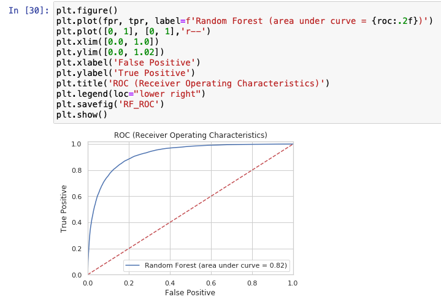

# Introduction to Jupyter Notebook


Personally, I like jupyter notebook a lot, since it offers plenty of useful tools to work on your code. Specifically, it enables you to test your code on the run by providing multiple cells which can be used to run specific parts of the code. In case, there are errors in some parts of the code, then you don't need to rerun the whole code but only the part you have errors. Moreover, it offers a convenient way to visualize your code, to inspect the variables.



## Installation

For conda users following command is good to go:

```bash
conda install -c conda-forge notebook
```

For old-school pip:

```bash
pip install notebook
```

## Usage

In order to launch the notebook:

```bash
jupyter notebook
```

If you are interested in using jupyter notebook through a specific port (9999 for instance):

```bash
jupyter notebook --port 9999
```

After running the command, the main browser should open a tab for your notebooks, in case it doesn't happen, you can just copy and paste the link printed in the command-line.

## Remote

If you want to access the notebooks in a remote machine, you need to forward everything on the port 9999 (the port you use for jupyter-notebook) of the server (in 127.0.0.1:9999) to local machine on the port 19999 (again this can be any port). This can be done by connecting to server with a small addition to the original ssh command.

```bash
ssh -L 19999:127.0.0.1:9999 acc_name@server_ip
```

Then you will be able to connect the jupyter-notebook of interest through the following [link](http://127.0.0.1:19999) (http://127.0.0.1:19999) from your local device.


Congratulations, you can enjoy your notebook.


