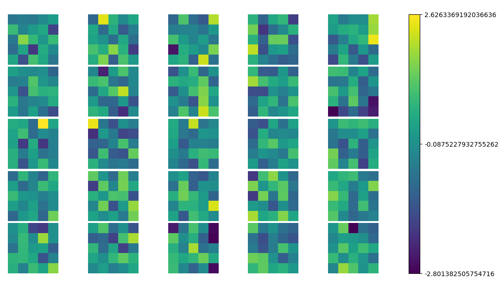

# What is Matplotlib

Matplotlib is a library to visualize the stuff you are interested in. It offers a number of different visualization tools ranging from simple 1d plots to interactive 3d colorful plots. This blog is still in development and contains the visualization techniques that at some point I've used. Whenever I learn a new technique, I will add that to here.

## Installation

For conda users following command is good to go:

```bash
conda install -c conda-forge matplotlib
```

For old-school pip:

```bash
pip install matplotlib
```

## Examples

In order to plot multiple images and use a common colorbar, we can use following codes. I've tried to explain every functionality I've used.

```python
import numpy as np
import matplotlib
import matplotlib.pyplot as plt
import matplotlib.gridspec as gridspec
matplotlib.rc('text', usetex=False)


filters = np.random.randn(25,5,5)

min_weight = np.min(filters)
max_weight = np.max(filters)

fig, axes = plt.subplots(nrows=5, ncols=5, figsize=(7, 7))

for i, ax in enumerate(axes.flat):
    ax.set_axis_off() # since I am plotting images, I don't want to see axis numbers.
    im = ax.imshow(filters[i], cmap='viridis',
                   vmin=min_weight, vmax=max_weight)

fig.subplots_adjust(bottom=0.1, top=0.9, left=0.1, right=0.8,
                    wspace=0.04, hspace=0.04)

cb_ax = fig.add_axes([0.83, 0.1, 0.02, 0.8])
cbar = fig.colorbar(im, cax=cb_ax)

#set the colorbar ticks and tick labels
cbar.set_ticks(np.arange(min_weight, max_weight, (max_weight-min_weight-0.001)/2))
cbar.set_ticklabels([min_weight, (max_weight+min_weight)/2, max_weight])

plt.show()
```




