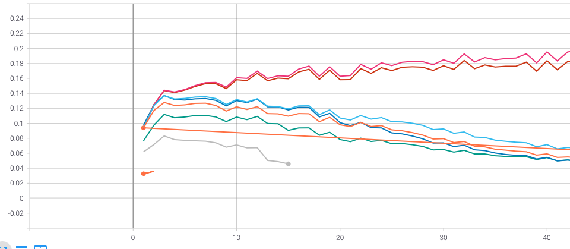
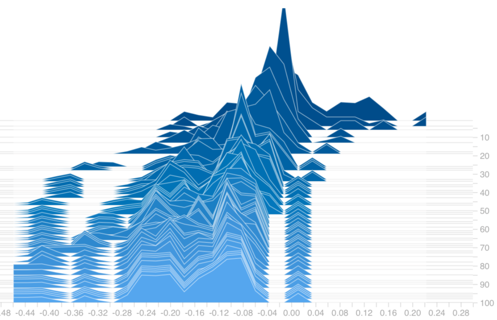

# Tensorboard usage on Pytorch

One of my favorite tool in machine learning is Tensorboard which can be used to visualize a number of different statistics about your model. It has been always hard for me to interpret the behaviour of a neural network.



Taking a glance at the parameters or how they progress over the training procedure is always valuable, especially getting to know your model better enables you further improve the performance of the model. Tensorboard provides convenient and efficient tools to visualize your models' statistics. 



## Installation

Firstly, install tensorboard via pip:

```bash
pip install tensorboard
```

## Usage

Call tensorboard with the following command on commandline (here --logdir accepts the directory for the tensorboard data):

```bash
tensorboard --logdir=runs
```

If you are on a jupyter-notebook:

```python
%tensorboard --logdir=runs
```

Dashboard can be accessed through this [link](http://localhost:6006/) (http://localhost:6006/)

## Remote

On the other hand, if you are working on a remote server, you need to forward everything on the port 6006 of the server (in 127.0.0.1:6006) to the local machine on the port 16006 (again this can be any port). This can be done by connecting to server with a small addition to the original ssh command.
```bash
ssh -L 16006:127.0.0.1:6006 acc_name@server_ip
```
Here, "-L" option allows you to map a specific port on the server machine to your local machine's port.

Then you will be able to connect the tensorboard of interest through following [link](http://127.0.0.1:16006) (http://127.0.0.1:16006) from your local device.

## Example Usage

Then, you are good to go. Enjoy tracking the important statistics through training progress. Following code snippet helps you understand how to track the statistics of interest.

```python
from torch.utils.tensorboard import SummaryWriter

writer = SummaryWriter()

for n_iter in range(100):
    writer.add_scalar('Loss/train', np.random.random(), n_iter)
    writer.add_scalars('run_14h', {'xsinx':i*np.sin(i/r),
                                   'xcosx':i*np.cos(i/r),
                                   'tanx': np.tan(i/r)}, i)

    x = np.random.random(1000)
    writer.add_histogram('distribution centers', x + i, i)

writer.close()
```

# References

For further details:

- https://pytorch.org/docs/stable/tensorboard.html

- https://stackoverflow.com/questions/37987839/how-can-i-run-tensorboard-on-a-remote-server


