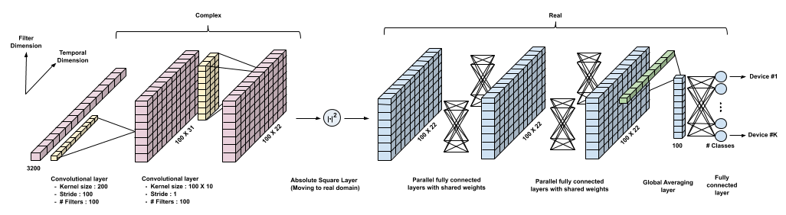

<ul>
	<li>Our goal is to learn&nbsp;<strong><em>RF signatures</em></strong>&nbsp;that can distinguish between devices sending&nbsp;<em>exactly</em>&nbsp;the same message. This is possible due to subtle hardware imperfections (labeled&nbsp;"nonlinearities" in the figure below) unique to each device.</li>
</ul>

<ul>
	<li>Since the information in RF data resides in complex baseband, we employ CNNs with complex-valued weights to learn these signatures. This technique&nbsp;does&nbsp;not use&nbsp;signal domain knowledge and can be used for any wireless protocol. We demonstrate its effectiveness for two protocols -&nbsp;WiFi and ADS-B.</li>
</ul>

<ul>
	<li>We show that this&nbsp;approach is vulnerable to spoofing&nbsp;when using&nbsp;the entire packet:&nbsp;the CNN focuses on&nbsp;fields containing ID info (eg. MAC ID in WiFi) which can be easily spoofed. When using the preamble alone, reasonably high accuracies are obtained, and performance is significantly enhanced by noise augmentation.</li>
</ul>

<ul>
	<li>We also study robustness to confounding factors&nbsp;in data collected over multiple days and locations, such as the carrier frequency offset (CFO), which drifts over time, and the wireless channel, which depends on the propagation environment. We show that carefully designed data augmentation is critical for learning robust wireless signatures.</li>
</ul>

<small>&nbsp;</small>

  

    

<h3 class="">Yayınlar</h3>

	

	  

	    
 <b>Metehan Cekic*</b>,&nbsp;Soorya Gopalakrishnan*,&nbsp;Upamanyu Madhow, "<a href="https://arxiv.org/pdf/2002.10791.pdf" target="_self">Robust Wireless Fingerprinting: Generalizing Across Space and Time</a>", arXiv:2002.10791.

 
 

  

	

	  

	    
Soorya Gopalakrishnan*, <b> Metehan Cekic* </b>,&nbsp;Upamanyu Madhow, "<a href="https://www.ece.ucsb.edu/~metehancekic/publication/fingerprinting-2019-globecom/" target="_self">Robust Wireless Fingerprinting via Complex-Valued Neural Networks</a>", <i>IEEE Global Communications Conference (Globecom)</i>,&nbsp;Waikoloa, Hawaii, Dec. 2019. 
          

  

