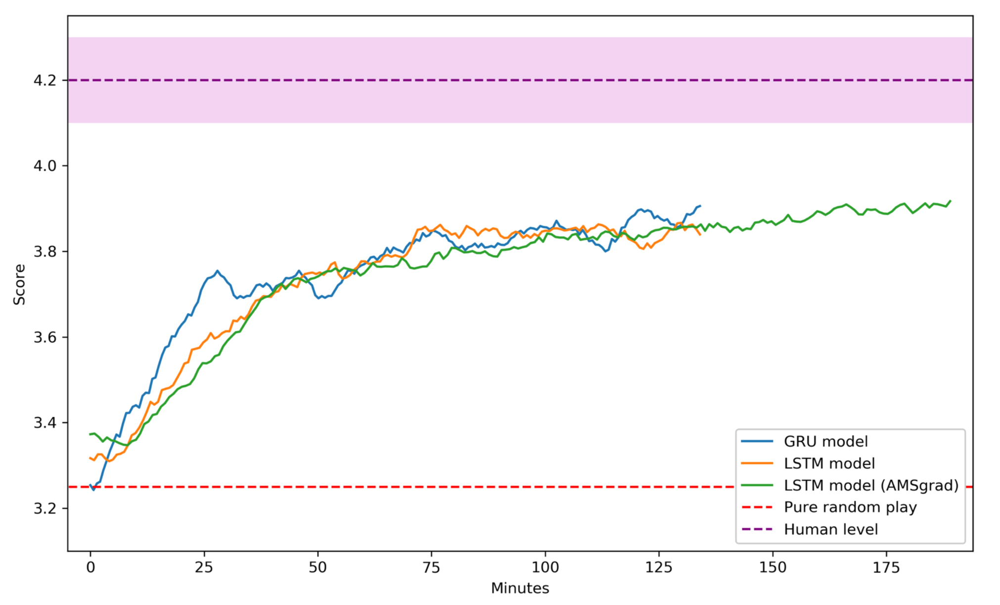

## **The Batak Game** #

Batak is a card game widely played in Turkey. It is similar to Bridge, where after the deck is dealt, players bid -based on their judgment of the value of their hand- in an auction to determine the *trump* suit. In Batak, each *play* consists of 13 *tricks*. A trick is where each player plays 1 card. The play goes as follows: in the first trick, the player that won the auction starts. They play a card from a non-trump suit. Each player has to play a card from the same suit and increase the card’s value. If they can’t increase they can play a lower value card of the same suit. If they don’t have any card of that suit, they can play a card from the trump suit. If they don’t have any card from the trump suit, they can play a card from any other suit they have. In each trick afterwards, the winner of the previous trick starts and other players play according to the same rules outlined above. There are two important rules. Number one, if you have a card of the same suit as the initial suit of the trick, you have to play and you have to increase if you can. Number two, players can’t play the trump suit as the first card of a trick unless trump suit has been "unlocked" by a player in an earlier trick by him/her not having the suit of that trick, and playing trump suit. In the end, scores are assigned by the number of tricks each player won. If the winner of the auction scored less than their bid, they are assigned negative of the bid as the score. So the advantage of winning the auction is being able to determine the trump suit, the disadvantage is the high negative score in the case of failure to win tricks as many as the bid. In a game, there are usually 10 plays, the goal of the game is to get the highest score.

## **Advantage Actor-Critic Algorithm (A2C)** #

The main property of the A2C algorithm is that it not only optimizes a policy but also trains a value function for the current state to assess how good is that policy for that specific state. In general, policy-based methods and value-based methods have a number of upsides and downsides. A2C algorithm is designed to combine the benefits of both value based and policy based approaches.

Value-based algorithms require a value function to be calculated for every possible action, although it is more sample efficient. On the other hand, policy-based methods can easily utilized on continuous action spaces due to its direct optimization of policy. However, low sample efficiency causes them to converge slower.

A2C algorithm estimates both policy and value function via deep neural network. Value function corresponds to the worth of that state to be in and the policy gives the probabilities of each available actions for that state.

 $ \pi(a|s;\theta)$: the probability of action $a$ given the state $s$ 

	
$V_{\pi}(s)$ : How good is it to be in state $s$

 
The value function is mathematically defined as expected reward of a trajectory after the state that agent is at that time in, which is only dependent on $s$.
 

$V_{\pi_{\theta}}(s)=E_{\tau}(R_{\tau}|s_0 =s,\pi_{\theta})$

 
Where $\tau$ represents the trajectory until game ends. Hereafter, for simplicity we drop $\theta$ from $\pi$, which means $\pi$ is parameterized by $\theta$. Critic of the agent evaluates the policies by computing the advantage function of specific action in a given state, which is defined as follow:

$A_{\pi}(s,a) = Q_{\pi}(s,a)−V_{\pi}(s)$ : The advantage of making action a in state s

 
Where Q function is another value function which depends on both state and action, particularly it
corresponds to the value of an action $a$ at a state $s$. Observe that with given definitions: 

$V_{\pi}(s) = 􏰀 \sum_{a\in A}\pi(a|s)Q_{\pi} (s, a)$

 

The algorithm utilizes the fact that there is a trajectory obtained from a game play (An agent interacted with the environment with a given policy function) by computing Q values from empirical discounted reward:

$Q_{\pi}(s,a) = R =\sum_{i=0}r_{t_i} \gamma^i $

 
where $\gamma$ corresponds to the how important are the future rewards compared to the current reward (1 means equally important, whereas 0.5 means each time step decreases the value of future reward by half).

As we have 2 different outputs for our deep neural network, namely policy and value functions, we have two different loss functions. The value loss is defined as mean squared error (MSE) between empirical discounted reward and the value output. This loss motivates neural net to learn to assess policy better after each iteration.

$Loss_{value} =􏰀\sum(R−V_{\pi}(s;\theta_v))^2$

 
Similarly, we want to increase the probability of an action which has positive advantage to increase empirical reward, therefore policy loss is defined by:

$Loss_{policy} =\log\frac{1}{\pi(a|s;\theta_p)} A_{\pi}(s,a;\theta_v)−\beta H(\pi)$

 
The loss function includes the last term to increase entropy of the action distribution, in other words, we push neural network to explore more. Typical $\beta$ value is 0.001, it is a good hyperparamemeter to adjust between exploration and exploitation which is a dilemma we always encounter in reinforcement learning algorithms. More inclination towards higher $\beta$ values causes neural net to explore more, whereas low $\beta$ values stick with the locally optimum policy.

## **Asynchronous Advantage Actor-Critic Algorithm (A3C)** #

Asynchronous gradient descent boosts the performance of traditional reinforcement algorithms like A2C and Q learning. The main idea of framework is having a master neural network and updating it with the gradients computed from some other worker networks.
In standard reinforcement algorithms we usually use memory mechanism to feed earlier experience of the agent when updating the neural network. We call this concept as "experience replay", which is helpful to stabilize learning. Running parallel agents independently stabilizes learning without "experience replay" because of the stochasticity in the game each agent experiences totally different action-reward trajectory. Moreover, as all agents play the game in parallel, training time is reduced roughly linear in the number of parallel actors.

## **Our Model** #

We decided that in order to capture the sequential information within the game we should either keep a list of all played cards explicitly in some form of memory, or we should use an RNN that would learn to extract the underlying temporal information implicitly. We decided to go with the second option as the first option requires much bigger input sizes which in turn requires bigger number of neurons in the model. With this decision, we determined the essential states of the game that a human player uses when playing and made these the inputs to our model. They are: trump suit (One-hot vector of length 4), hand (Boolean vector of length 52) and current and past trick’s cards up to our model’s turn, along with who played them.(Boolean matrix of size 7 by 56) Cards are represented by one-hot vector of length 52, players are represented by one-hot vector of length 4, then these vectors are concatenated to form vector of size 56.

In following figure, overall architecture of our model is displayed, with the LSTM unrolled in time to give a better sense of time dependency.

## **Results** #

We trained 3 different architectures with Nvidia GeForce GTX 1080 Ti. To be able to evaluate trained agent, we get a couple of people (Who knows and plays the game very well) play the game against random-playing bots similar to trained agent.

Results are given in following figure. As can be seen from the figure, all architectures we experimented performs similarly and much better than random playing games. However, all architectures perform slightly worse than humans.

## **Conclusion** #

In this project, we wanted to implement and evaluate the performance of A3C algorithm on the Turkish game called "Batak". We also wanted to observe the effect of architecture and optimization method for convergence. As can be seen from the results section, the architectures we tried so far perform more or less same.

We trained agent in the game without auction, next step for this project would be to improve bots to be able play with auction (learn and bid accordingly). Moreover, we plan to develop agent by making it play against itself (Instead of random bots).

